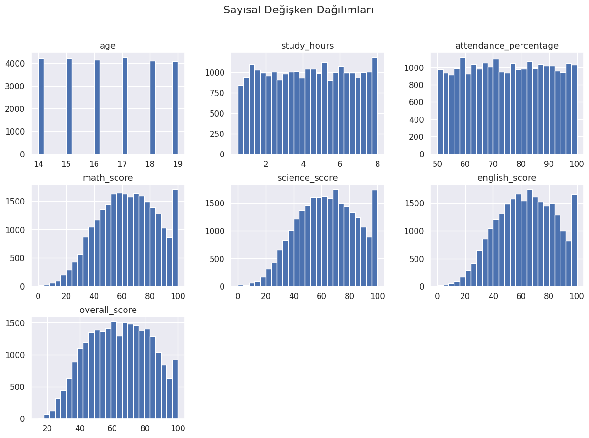
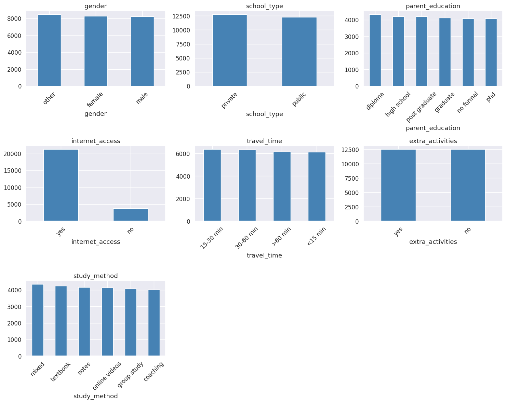
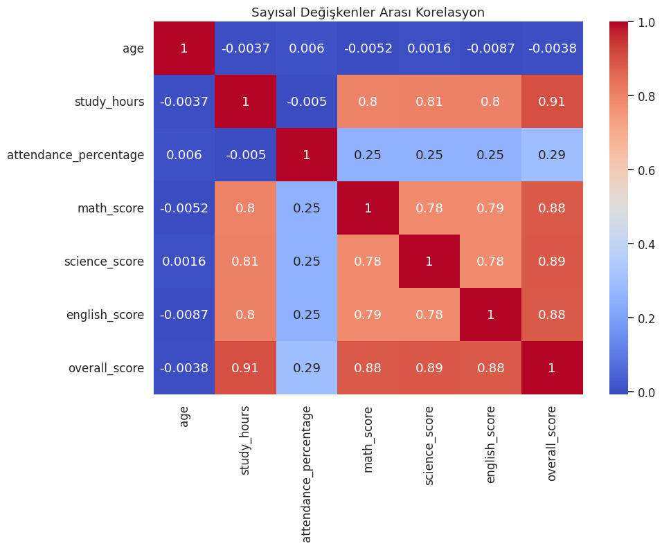

[README.md](https://github.com/user-attachments/files/23728340/README.md)
#  Student Performance – Overall Score Prediction

Bu proje, 25.000 öğrencinin demografik, akademik ve sosyal özelliklerinden yararlanarak **overall_score** değerinin tahmin edilmesini amaçlayan bir makine öğrenmesi çalışmasıdır. Proje boyunca veri analizi, veri ön işleme, model eğitimi ve model karşılaştırması gibi temel ML adımları uygulanmıştır.

---

##  Projenin Amacı

Öğrencilerin:

- yaş,
- çalışma süresi (study_hours),
- devamsızlık oranı (attendance_percentage),
- okul türü,
- aile eğitim seviyesi,
- internet erişimi,
- ders çalışma yöntemi,
- ek aktivitelere katılım

gibi faktörlere bakarak öğrencinin **overall_score** değerini tahmin etmek.

---

##  Veri Seti Hakkında

- **Örnek sayısı:** 25.000  
- **Sütun sayısı:** 16  
- **Hedef değişken:** `overall_score`

###  Data Leakage Engelleme

Aşağıdaki sütunlar hedef değişkeni doğrudan oluşturduğu için modele dahil edilmemiştir:

- `math_score`  
- `science_score`  
- `english_score`  
- `final_grade`  
- `student_id`

Bu sütunlar çıkarılarak modelin yapay şekilde yüksek performans göstermesinin önüne geçilmiştir.

---

##  Uygulanan Adımlar

### **1. Keşifsel Veri Analizi (EDA)**  
- Eksik veri kontrolü  
- Sayısal değişken dağılımları  
- Kategorik değişken frekans grafikleri  
- Korelasyon analizi  
- Hedef değişken incelemesi  

### **2. Veri Ön İşleme**  
- Gereksiz sütunların kaldırılması  
- Sayısal ve kategorik sütun ayrımı  
- One-Hot Encoding  
- StandardScaler ile ölçekleme  
- Train/Test split (%80 / %20)

### **3. Modelleme**  
Aşağıdaki modeller eğitilmiş ve değerlendirilmiştir:

- Linear Regression  
- Random Forest Regressor  
- KNN Regressor  

Performans metrikleri olarak MAE, RMSE ve R² kullanılmıştır.

---

##  Model Sonuçları

| Model             | MAE   | RMSE  | R² Score |
|-------------------|-------|-------|----------|
| Linear Regression | 5.00  | 5.77  | 0.908    |
| Random Forest     | 3.32  | 4.52  | 0.943    |
| KNN               | 8.98  | 11.16 | 0.656    |

---

##  En İyi Model: Random Forest Regressor

Random Forest modeli tüm metriklerde en iyi performansı göstermiştir:

- En düşük **MAE**  
- En düşük **RMSE**  
- En yüksek **R²** (0.94)

Bu modelin üstün performansı:

- doğrusal olmayan ilişkileri yakalayabilmesi,  
- kategorik + sayısal verilerle iyi çalışması,  
- ensemble yapısı sayesinde overfitting’e karşı dayanıklı olması  

gibi sebeplerle açıklanabilir.

Linear Regression güçlü bir baseline sunarken, KNN modeli bu veri setinde düşük performans göstermiştir.

---

##  Genel Değerlendirme

- Öğrenci başarısı; çalışma süresi, devamsızlık oranı, aile eğitim düzeyi ve çalışma yöntemi gibi değişkenlerden önemli ölçüde etkilenmektedir.  
- Veri ön işleme adımları, özellikle leakage engelleme ve encoding, model performansını ciddi ölçüde iyileştirmiştir.

- Random Forest, tahmin performansı açısından bu veri seti için en uygun model olmuştur.  
- Elde edilen R² değeri (~0.94), bağımsız değişkenlerin hedef değişkeni güçlü bir şekilde açıkladığını göstermektedir.

---
##  Projeyi Çalıştırma

Bu proje bir Jupyter Notebook içerir ve çalıştırma yöntemi aşağıda verilmiştir.

---

###   Google Colab'da Çalıştırma 

1. Depodaki `.ipynb` dosyasını açın.
2. Sağ üstteki **Open in Colab** butonuna tıklayın.  
   (Buton görünmüyorsa https://colab.research.google.com adresinden notebooku manuel yükleyebilirsiniz.)
3. Notebook'daki ilgili alana ML vize klasörünün içinde bulunan data klasörünün içindeki data dosyasını alın ve dosyanın yolunu yapıştırın.
4. Son olarak notebook'da hücreleri sırasıyla çalıştırın.

## 🖼️ Örnek Çıktılar

Aşağıda model eğitimi sırasında elde edilen bazı örnek grafikler  yer almaktadır.  

---

###  1. Sayısa Değişken Dağılımı 

---
---

###  2. Kategorik Değişken Dağılımı 

---

###  3. Korelasyon Matrisi

Bu grafik, değişkenler arasındaki ilişkiyi görselleştirir.

---

Bu görseller, projenin analiz sürecini ve model performansını daha iyi anlamaya yardımcı olur.

